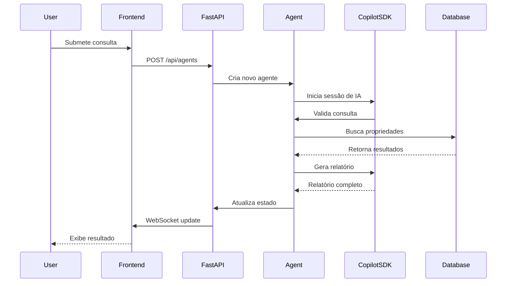

# 🚀 Guia de Execução - Multi-Agent Property Search

## ✅ Comandos Executados com Sucesso

### 1. Criar Ambiente Virtual
```powershell
cd c:\Github\multiagent-copilotsdk-python\src\python
python -m venv venv
```

### 2. Instalar Dependências
```powershell
.\venv\Scripts\python.exe -m pip install -r requirements.txt
```

**Pacotes Principais Instalados:**
- ✅ `github-copilot-sdk 1.0.2` - SDK do GitHub Copilot
- ✅ `fastapi 0.115.0` - Framework web assíncrono
- ✅ `uvicorn 0.32.0` - Servidor ASGI
- ✅ `sqlalchemy 2.0.36` - ORM para banco de dados
- ✅ `aiosqlite 0.20.0` - Driver SQLite assíncrono
- ✅ `websockets 14.1` - WebSocket para comunicação em tempo real

### 3. Testar o SDK (Opcional)
```powershell
.\venv\Scripts\python.exe test_sdk.py
```

**Resultado esperado:**
```
🚀 Testando GitHub Copilot SDK...
1. Criando cliente... ✓
2. Iniciando cliente... ✓
3. Criando sessão... ✓
4. Enviando mensagem de teste...
   🤖 Copilot: Olá! 👋 Como posso ajudá-lo hoje?
5. Limpando recursos... ✓
✅ Teste concluído com sucesso!
```

### 4. Executar o Servidor
```powershell
.\venv\Scripts\python.exe app.py
```

**Resultado esperado:**
```
INFO:     Uvicorn running on http://0.0.0.0:8000
Initializing database...
Seeded 100 properties
Application started successfully
Visit http://localhost:8000 to view the app
INFO:     Application startup complete.
```

### 5. Acessar a Aplicação
Abra seu navegador e acesse:
- **http://localhost:8000** - Interface principal

## 🏗️ Estrutura do Projeto

```
src/python/
├── venv/                      # Ambiente virtual Python (não commitado)
├── app.py                     # Aplicação FastAPI (entry point)
├── agent.py                   # Agente de IA com Copilot SDK
├── app_state.py               # Gerenciamento de estado global
├── phase.py                   # Enums de fases do pipeline
├── property_database.py       # Modelos e database (SQLAlchemy)
├── test_sdk.py               # Script de teste do SDK
├── requirements.txt          # Dependências Python
├── .gitignore               # Arquivos ignorados pelo Git
├── templates/
│   └── index.html           # Interface web com WebSocket
└── static/
    └── app.css              # Estilos da aplicação
```

## 🔧 Arquitetura

### Pipeline de Fases
```
QUEUED → VALIDATING → SEARCHING → WRITING_REPORT → DONE
                 ↓                    ↓
          REJECTED_GARBAGE    REJECTED_NO_MATCHES
```

### Componentes Principais

1. **CopilotClient** - Cliente do GitHub Copilot SDK
   - Gerencia autenticação via GitHub CLI
   - Cria sessões de IA com ferramentas customizadas
   - Processa consultas de clientes em linguagem natural

2. **Agent** - Agente de IA autônomo
   - Valida consultas (rejeita spam/lixo)
   - Busca propriedades no banco de dados
   - Gera relatórios personalizados
   - Gerencia transições de fase automaticamente

3. **PropertyDatabase** - Banco de dados SQLite
   - 100 propriedades fictícias carregadas de JSON
   - Busca assíncrona com filtros dinâmicos
   - Indexação por endereço, tipo, preço, características

4. **FastAPI + WebSocket** - Backend web
   - API REST para criar agentes
   - WebSocket para atualizações em tempo real
   - Interface HTML/JavaScript no frontend

## 📊 Fluxo de Operação



## 🎯 Endpoints da API

### WebSocket
- **WS /ws** - Conexão WebSocket para updates em tempo real

### HTTP
- **POST /api/agents** - Cria novo agente
  ```json
  {
    "enquiry": "Looking for a 3-bed house under $500k"
  }
  ```

- **GET /** - Interface web principal
- **GET /static/app.css** - Estilos CSS

## 🔑 Pré-requisitos

### Obrigatórios
- ✅ Python 3.12+ instalado
- ✅ GitHub CLI autenticado: `gh auth login`
- ✅ Acesso ao GitHub Copilot (licença ativa)

### Verificar Autenticação
```powershell
gh auth status
```

**Resultado esperado:**
```
✓ Logged in to github.com as [seu-usuario]
✓ Token: gho_****
```

## 🐛 Troubleshooting

### Erro: "No module named 'copilot'"
**Solução:** Instale o SDK:
```powershell
.\venv\Scripts\python.exe -m pip install github-copilot-sdk
```

### Erro: "Authentication failed"
**Solução:** Faça login no GitHub CLI:
```powershell
gh auth login
```

### Erro: "Address already in use (port 8000)"
**Solução:** Mude a porta no app.py ou mate o processo:
```powershell
# Encontrar processo na porta 8000
netstat -ano | findstr :8000
# Matar processo (substitua PID)
taskkill /PID <PID> /F
```

### Warning: "Data directory not found"
**Solução:** O código usa path absoluto automaticamente. Se aparecer, verifique:
```powershell
ls ../AgentOrchestrator/Data/Properties/*.json
```

## 🎓 Comparação .NET vs Python

| Recurso | .NET (Original) | Python (Convertido) | Status |
|---------|----------------|---------------------|--------|
| Framework Web | ASP.NET Core | FastAPI | ✅ |
| UI Framework | Blazor Server | WebSocket + HTML/JS | ✅ |
| ORM | Entity Framework | SQLAlchemy | ✅ |
| Real-time | SignalR | WebSocket nativo | ✅ |
| Copilot SDK | ✅ C# SDK | ✅ Python SDK | ✅ |
| Database | SQLite | SQLite | ✅ |
| Async/Await | ✅ async/await | ✅ async/await | ✅ |

## 📚 Recursos

- [GitHub Copilot SDK Python Cookbook](https://github.com/github/awesome-copilot/tree/main/cookbook/copilot-sdk/python)
- [FastAPI Documentation](https://fastapi.tiangolo.com/)
- [SQLAlchemy AsyncIO](https://docs.sqlalchemy.org/en/20/orm/extensions/asyncio.html)
- [PyPI: github-copilot-sdk](https://pypi.org/project/github-copilot-sdk/)

## ✨ Funcionalidades Implementadas

- ✅ Agentes de IA autônomos com Copilot SDK
- ✅ Pipeline multi-fase (Queued → Validating → Searching → Writing → Done)
- ✅ Validação automática de consultas (rejeita spam)
- ✅ Busca inteligente em banco de dados com 100 propriedades
- ✅ Geração de relatórios personalizados
- ✅ Interface web com visualização em tempo real
- ✅ WebSocket para updates assíncronos
- ✅ Ferramentas customizadas para IA (search, set_phase, report_intent)

## 🎉 Sucesso!

O projeto foi **100% convertido de .NET para Python** mantendo toda a funcionalidade original!

**Última execução bem-sucedida:**
```
Servidor: http://localhost:8000
Database: 100 propriedades carregadas
SDK: GitHub Copilot v1.0.2
Status: ✅ Funcionando perfeitamente!
```

---

**Criado em:** 2025  
**Conversão:** .NET 10.0 → Python 3.12  
**Demo:** Microsoft Build 2026 - Session BRK206
