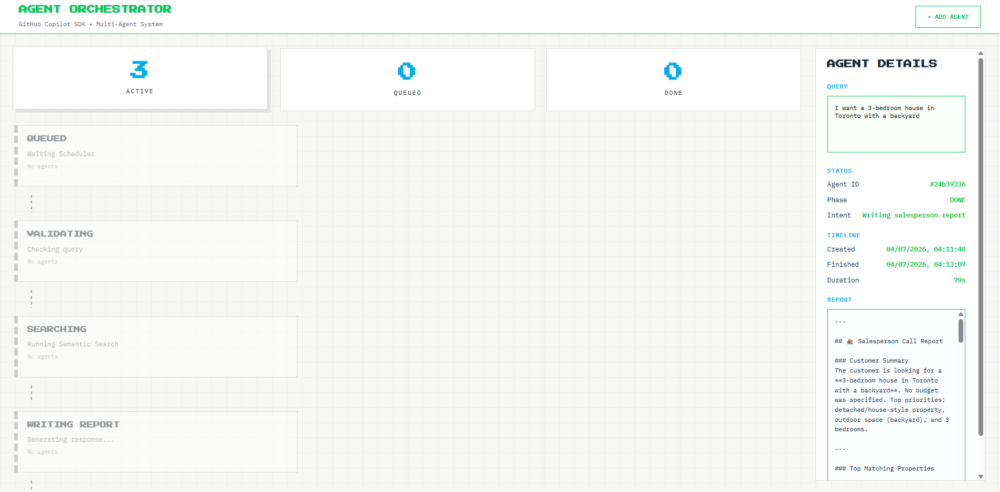

<a name="start-building"></a>
<br>
<p align="center">

</p>

#[Microsoft Build 2026](https://build.microsoft.com)

## 🔥 Your agent, anywhere: MultiClient, MultiDevice with GitHub Copilot SDK

## Demo Preview

The **Agent Orchestrator** dashboard shows AI agents moving through the pipeline in real time — from *Queued* to *Validating*, *Searching*, *Writing Report*, and finally *Done* — with the full salesperson report generated by the agent shown in the details panel.

<p align="center">

</p>

## 🚀 Getting Started

### 🐍 Python Implementation

This demo showcases the **GitHub Copilot SDK** capabilities for building intelligent multi-agent systems using Python.

- **Location**: [`src/python/`](src/python/)
- **Framework**: FastAPI + WebSockets
- **Run**: `python app.py` (from the python directory)
- **Port**: http://localhost:8000

#### Prerequisites

- **Python 3.10+** (developed and tested on 3.12)
- **GitHub CLI** authenticated — run `gh auth login`
- **GitHub Copilot subscription** (required for SDK access)

#### Step-by-Step: Run the Demo

1. **Clone the repository**

   ```bash
   git clone https://github.com/mayulabs/multiagent-copilotsdk-python.git
   cd multiagent-copilotsdk-python/src/python
   ```

2. **(Recommended) Create and activate a virtual environment**

   ```bash
   python -m venv venv
   # Windows (PowerShell)
   .\venv\Scripts\Activate.ps1
   # macOS / Linux
   source venv/bin/activate
   ```

3. **Install dependencies**

   ```bash
   pip install -r requirements.txt
   ```

4. **Authenticate with GitHub** (the SDK uses your GitHub CLI credentials)

   ```bash
   gh auth login
   ```

5. **Run the application**

   ```bash
   python app.py
   ```

6. **Open the dashboard** at [http://localhost:8000](http://localhost:8000) and click **+ ADD AGENT** to submit a query (e.g. *"I want a 3-bedroom house in Toronto with a backyard"*).

📖 See the [Python README](src/python/README.md) for architecture details and troubleshooting.

### 🧠 Learning Outcomes

By the end of this session, you will be able to:

- Embed GitHub Copilot's runtime into any app securely​
- Understand multi-client, multi-device agent deployment ​
- Know what is new in the new GA 1.0 GitHub Copilot SDK


### 🌟 Additional Resources

Explore more ways to extend your agents:

- **[Microsoft Learn MCP Server](https://aka.ms/learnmcp)** - Connect your agents to official Microsoft documentation
- **[GitHub Copilot Extensibility](https://github.com/github/awesome-copilot)** - Custom tools, context, and workflows

## ♻️ Reusing the Agent in Your Own Project

Want to take this multi-agent pattern into a new project? The core is decoupled from the property-search demo, so you can reuse it. Here's how:

1. **Copy the core modules** from [`src/python/`](src/python/) into your project:
   - [`agent.py`](src/python/agent.py) — the agent class that drives a Copilot SDK session, captures tool calls, phase transitions, and the final report.
   - [`phase.py`](src/python/phase.py) — the pipeline phase definitions (rename/extend these to match your workflow).
   - [`app_state.py`](src/python/app_state.py) — in-memory state management and serialization for the UI.

2. **Install the SDK** in your environment:

   ```bash
   pip install github-copilot-sdk
   ```

3. **Define your own phases** — edit `Phase` in `phase.py` to describe *your* workflow (e.g. `TRIAGE`, `ENRICH`, `RESPOND`) instead of the property-search phases.

4. **Swap the tools** — in `agent.py`, replace the demo tools (`search`, `web_fetch`, etc.) with functions relevant to your domain. Each tool is a plain Python function exposed to the AI; the model decides when to call them based on your system prompt.

5. **Update the system prompt / instructions** — the agent's behavior is driven by natural-language instructions, not hardcoded logic. Rewrite them to describe your task and the phases the agent should move through.

6. **Bring your own UI (optional)** — the demo uses FastAPI + WebSockets ([`app.py`](src/python/app.py)) to stream state to the browser. You can reuse it, replace it with your own frontend, or run the agent headless and just consume the serialized state.

> 💡 **Tip:** Start by running the demo as-is, then change one phase and one tool at a time. Because the orchestration is instruction-driven, most customization happens in the prompt and tool definitions — not in framework plumbing.

## Content Owners

<table>
<tr>
    <td align="center"><a href="http://github.com/mayulabs">
        <br />
        <sub><b>Mayumi Shingaki</b></sub></a><br />
            <a href="https://github.com/mayulabs" title="Senior Software Engineer">📢</a>
    </td>
</tr></table>

## 📄 License

This project is licensed under the terms described in the repository's license files:

- **Source code** — see [LICENSE](LICENSE) (MIT).
- **Documentation and content** — see [LICENSE-DOCS](LICENSE-DOCS).

You are free to use, modify, and reuse the code (including the agent) in your own projects under these terms. When reusing, keep the license notice and review the [Trademarks](#trademarks) section below regarding Microsoft names and logos.

## Contributing

This project welcomes contributions and suggestions.  Most contributions require you to agree to a
Contributor License Agreement (CLA) declaring that you have the right to, and actually do, grant us
the rights to use your contribution. For details, visit [Contributor License Agreements](https://cla.opensource.microsoft.com).

When you submit a pull request, a CLA bot will automatically determine whether you need to provide
a CLA and decorate the PR appropriately (e.g., status check, comment). Simply follow the instructions
provided by the bot. You will only need to do this once across all repos using our CLA.

This project has adopted the [Microsoft Open Source Code of Conduct](https://opensource.microsoft.com/codeofconduct/).
For more information see the [Code of Conduct FAQ](https://opensource.microsoft.com/codeofconduct/faq/) or
contact [opencode@microsoft.com](mailto:opencode@microsoft.com) with any additional questions or comments.

## Trademarks

This project may contain trademarks or logos for projects, products, or services. Authorized use of Microsoft
trademarks or logos is subject to and must follow
[Microsoft's Trademark & Brand Guidelines](https://www.microsoft.com/legal/intellectualproperty/trademarks/usage/general).
Use of Microsoft trademarks or logos in modified versions of this project must not cause confusion or imply Microsoft sponsorship.
Any use of third-party trademarks or logos are subject to those third-party's policies.
